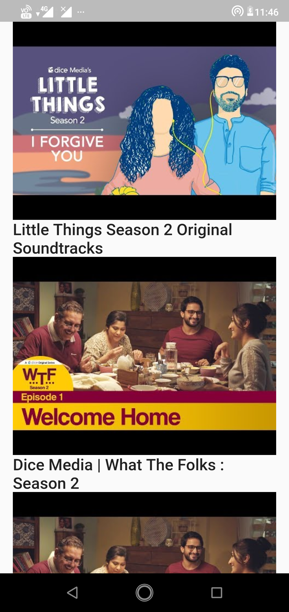
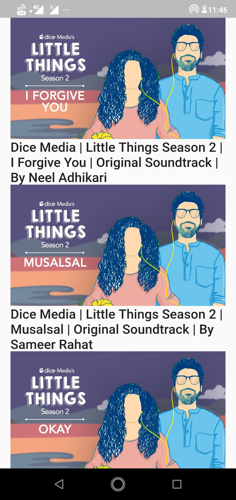

# youtubeclone

A new Flutter project.
<li>

Flutter: Animation Series || Episode 1 || Basic Animation 

</li>
<h4>1)Dont forget to put api key</h4>

### Show some :heart: and star the repo to support the project

## Facebook

[Prateek Timer](https://www.facebook.com/pbanawalkar)

# Screenshots
    

### LICENSE & COPYRIGHT
Copyright 2018 Pratik Banawalkar

Licensed under the Apache License, Version 2.0 (the "License");
you may not use this file except in compliance with the License.
You may obtain a copy of the License at

   http://www.apache.org/licenses/LICENSE-2.0

Unless required by applicable law or agreed to in writing, software
distributed under the License is distributed on an "AS IS" BASIS,
WITHOUT WARRANTIES OR CONDITIONS OF ANY KIND, either express or implied.
See the License for the specific language governing permissions and
limitations under the License.

## Getting Started

This project is a starting point for a Flutter application.

A few resources to get you started if this is your first Flutter project:

- [Lab: Write your first Flutter app](https://flutter.io/docs/get-started/codelab)
- [Cookbook: Useful Flutter samples](https://flutter.io/docs/cookbook)

For help getting started with Flutter, view our 
[online documentation](https://flutter.io/docs), which offers tutorials, 
samples, guidance on mobile development, and a full API reference.
